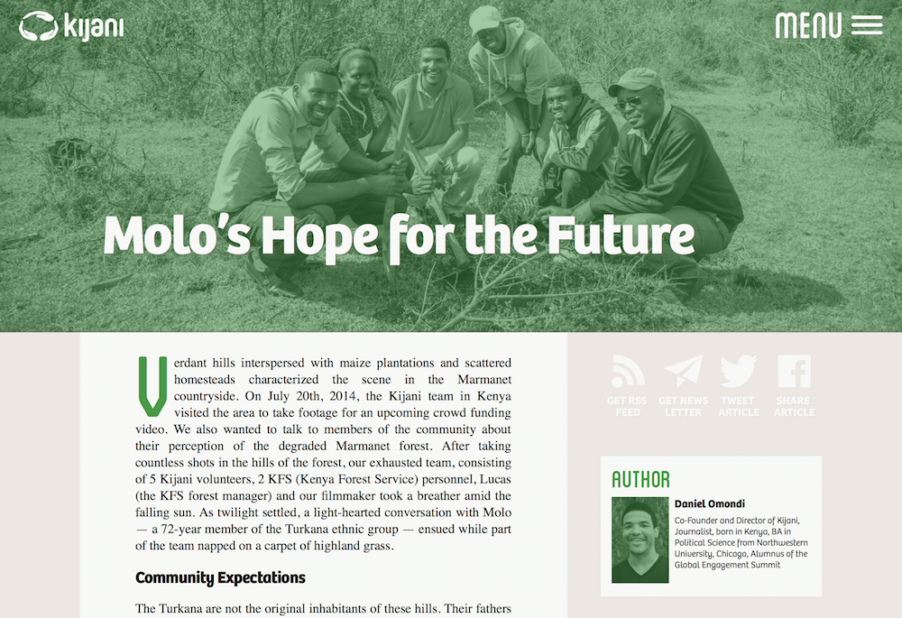

# Kijani Webdesign

## Description
This is a repository to experiment with the design of the [Kijani Blog](http://blog.kijani.co) and also for the general [Kijani Website](http://kijani.co) in the future.

This is not supposed to host the actual code for the Kijani Blog and the Kijani Website, which are hosted at:
- [dudheit314/kijani-blog](https://github.com/dudheit314/kijani-blog)
- [mrloh/kijani.ngo](https://github.com/MrLoh/kijani.ngo)

Feel free to contribute to this by sending me pull requests.

## Requirements

This CSS is written in Sass, please use the latest Sass to contribute. The code has been written with [Brackets](http://brackets.io), which I can recommend for editing this as well. Sass compiling can then easily be done with the [Bracket Sass Plugin](https://github.com/jasonsanjose/brackets-sass).

The code is only optimized for Webkit Browsers, i.e. Chrome and Safari. Since this is not for actual distribution, let's keep it like that for simplicity sake. 

<!--This does not include font files. To work properly you need to install the Font [Bree](http://www.type-together.com/Bree). Please contact me, if you need the font, but I can't distribute it publicly.-->

## Todos
- [x] ~~Implement Basic Article Style~~
- [x] ~~Fix Heading and Hero Image~~
- [x] ~~Restructure Folders~~
- [x] ~~Finish Author Section~~
- [x] ~~Finish More Articles Section~~
- [x] ~~Add Scrolling over the Header~~
- [x] ~~Add Share and Subscribe Section~~
- [x] ~~Add Image Captionss~~
- [x] ~~Add Navigation~~
- [x] ~~Create Mobile Styles~~
- [x] ~~Make Crossbrowser Compatible~~
- [x] ~~Add List Styles~~
- [ ] Add Citation Styles
- [ ] Add Navbar on Scroll Up
- [ ] Add Archive Page
- [ ] Add Comments
- [ ] Add Footer

## Current Status
Visit the page life at: [mrloh.github.io/kijaniwebdesign](http://mrloh.github.io/KijaniWebdesign/)

